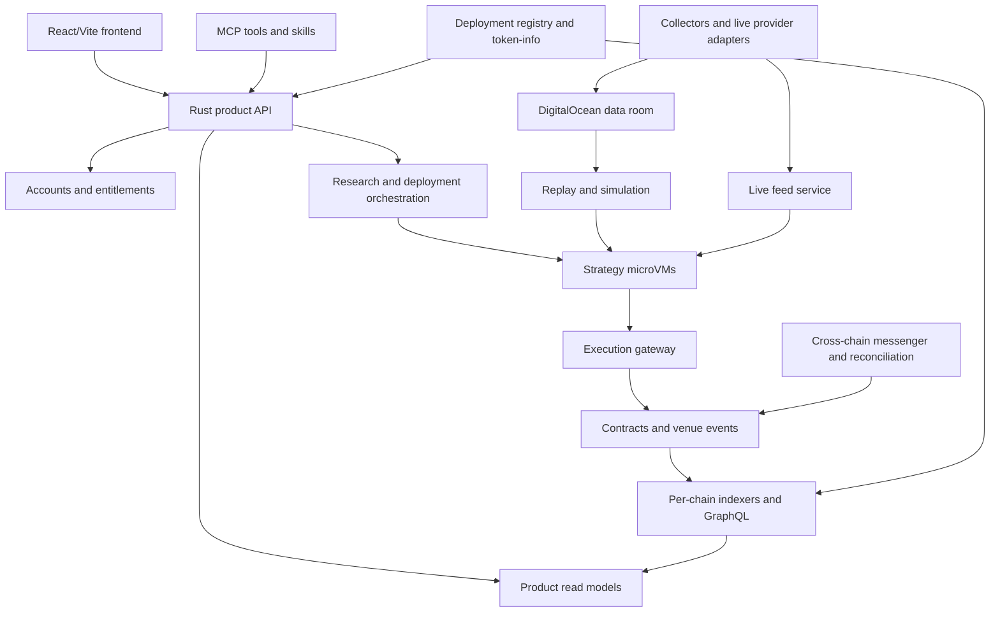

# Architecture, imports, and address authority

## 1. Logical architecture



The indexer path serves contract state and investment views. Market-data streams, order acknowledgments, and strategy account snapshots use separate low-latency interfaces. The execution gateway verifies current actionable state rather than trusting a potentially stale frontend read model.

## 2. Service boundaries

| Service | Owns | Boundary |
| --- | --- | --- |
| product-api | User-oriented commands, aggregation, public catalog | No embedded strategy execution or chain indexing |
| auth-service | Users, sessions, wallet links, memberships | Wallet ownership does not imply billing rights |
| billing-service | Stripe reconciliation and grants | Cannot sign trades or freeze redemption |
| token-info/registry | Chain-qualified identities and deployment discovery | Sole address resolution surface |
| indexer-hyperliquid | HyperEVM events plus relevant HyperCore activity | Reconciles Core/EVM settlement and exposes GraphQL |
| indexer-robinhood | EVM vault/router/transport events | Separate checkpoints and schema |
| indexer-solana | Program events/accounts, finalized projections | Handles slots, forks, and account versions |
| collector/normalizer/gold/catalog | Imported data-room pipeline | Owns market datasets and coverage |
| live-data | Provider sessions, normalization, aggregation | No custody oracle authority |
| backtest-service | Jobs, replay manifests, Rust simulation, reports | Remote execution only |
| runtime-controller | Artifact builds, microVM scheduling, leases | Cannot bypass gateway permissions |
| execution-gateway | Intent validation, order journal, submission | Isolated signing boundary; no arbitrary-sign endpoint |
| vault-keeper | Appraisal, capital maintenance, settlement, unwind | Limited deterministic actions |
| vault-messenger | Transport submission, retry, checkpoints | Initiates authenticated delivery; is not its verifier |
| mcp-service | Tool schemas, authorization, API orchestration | Same quotas and policies as frontend |

Maintain separate binaries and service-owned schemas. Initial services may share a managed database cluster and deployment hosts with independent database roles, migrations, resource limits, and failure boundaries. Microservices do not require a large cluster on day one.

## 3. Contracts and packages

Proposed repository layout:

```text
frontend/                       React/Vite product and public vault pages
landing/                        optional separate static landing build
python-sdk/                     strategy authoring SDK, templates, contracts
evm-contracts/                   hub, EVM spoke, adapters, transports, tests
solana-programs/                spoke and audited instruction adapters
rust-backend/crates/             shared schemas and domain logic
rust-backend/services/           independently deployable services
rust-backend/data-room/          imported entire data-room source tree
rust-backend/tools/deployment-manager/
rust-backend/infra-do/           DigitalOcean infrastructure as code
rust-backend/deployment/         adapted deployment and monitoring assets
registry/deployments.json        canonical authored deployment manifest
mcp/                            tool manifests and generated API bindings
skills/                         product skills and example workflows
docs/                           specification, decisions, provenance, runbooks
```

Shared crates should include registry-schema/client, instrument-schema, strategy-protocol, execution-types, vault-messages, accounting-reference, auth-client, and observability. Keep domain schemas free of Sui dependencies. Backtest simulation reuses execution types and economic reference math, not the entire production service dependency tree.

## 4. Address registry

There is one logical registry and one authorized mutation path. `registry/deployments.json` is the authored source for protocol deployments and external integration references; deployment-manager writes it from verified deployment results. It must not contain credentials.

Registry keys include environment, chain namespace/chain ID, logical deployment family, component role, version, and instance ID. Records carry address/program ID, interface hash, code hash where meaningful, deployment transaction, activation height, finality, capabilities, and predecessor. Token records include chain identity, mint/contract identity, decimals, symbol as display-only metadata, and linked economic asset ID. Transport IDs and venue instrument IDs are typed fields, not interchangeable chain IDs.

Factories and permissionless markets produce dynamic instances. Their finalized creation events are authoritative inputs to the registry service's instance catalog; these records must have provenance and cannot be independently overridden in application configuration. Both authored and discovered records are served through the same registry API. Product read models may mirror them but never become a second write authority.

Contracts receive counterpart addresses as deployment/initialization parameters from registry resolution. Consumers cache versioned snapshots. Cached records remain associated with the version that authorized a job or order; configuration changes cannot silently retarget an existing intent. A missing/unverified record fails closed for execution.

No literals for router, oracle, bridge, precompile, system contract, token, or vault addresses in app source, SDK examples, skills, or docs. If a chain toolchain requires compile-time program identity, generate it from the manifest and check byte-for-byte agreement in CI. Generated outputs are copies, never separately authored definitions. Vendor code must be wrapped so upstream hardcoded deployment constants cannot become an unreviewed execution path.

CI performs address-literal scanning in authored code with syntactic validation to avoid treating hashes as addresses; exceptions are named synthetic fixtures, generated artifacts, and quarantined vendored code. Also test runtime configuration agreement, because a text scanner alone cannot establish single-source behavior.

## 5. Core records and durable events

Identifiers: `user_id`, `wallet_id`, `strategy_id`, immutable `strategy_version_id`, `artifact_hash`, `feed_config_hash`, `backtest_id`, `dataset_manifest_hash`, `vault_family_id`, `vault_instance_id`, `deployment_id`, `mandate_version`, `registry_version`, `order_intent_id`, `transfer_id`, `message_id`.

Monetary API values are decimal strings with explicit units; custody/share math uses fixed-point integers with specified rounding. Timestamps retain source and received times. Do not use ticker as identity or floating point for custody balances.

All mutation APIs accept idempotency keys scoped to principal and operation. Durable job creation, allowance reservation, and event publication use a database transaction plus outbox. Consumers deduplicate through inbox/event keys. Order and bridge state transitions are persisted before external submission. Exactly-once economic effect is implemented using deduplication and reconciliation over at-least-once transport.

## 6. Import plan

Do not copy any market dataset, database dump, Terraform state, local environment, credential file, build output, or source project's live deployment manifest.

| Source in SuiOptions | Treatment |
| --- | --- |
| Entire `rust-backend/data-room/` source tree | Import source, tests, schemas, CI checks and deployment templates; preserve notices; adapt DO storage and providers |
| Backtester/desk components on `ewitulsk/backtest` | Reuse general replay, provenance, cost/risk/reporting machinery; separate options-specific logic |
| `contracts/trading-vault-v2`, economic spec/tests | Translate specification and test vectors into Solidity hub and Rust reference math; do not ship Move runtime |
| Multichain branch `evm-contracts`, `vault-messages`, `vault-messenger` | Import and review; replace Sui hub bindings and incomplete lane assumptions |
| `token-info`, `token-info-client`, `deployments` | Generalize chain-qualified types, preserve single-authority behavior |
| `tools/deployment-manager` | Keep orchestration/provenance; add EVM and Solana deploy/initialize/verify backends |
| `infra-do`, deployment/monitoring, GitHub Actions | Adapt resource ownership, service inventory, registry, alerts, and release targets |
| Auth and execution/signer services | Review and generalize; do not inherit Sui-specific authorization or unreviewed signing behavior |
| Frontend components | Reuse useful UI patterns; replace wallet, registry, and contract dependencies |

Each source snapshot gets a conspicuous `chore(import): ... from SuiOptions ...` commit containing only imported content and its provenance record. Follow with adaptation commits. Record upstream repository, full SHA, branch as informational context, original paths, licenses, hashes, and known limitations. The inspected backtest checkout has uncommitted work: explicitly inventory and hash any selected patch as a separate provenance input; do not falsely attribute it to the upstream commit.

The import record must distinguish pre-hackathon work from new work for submission. Importing entire data-room source does not mean enabling every legacy deployment script or accepting its historical cloud configuration.
